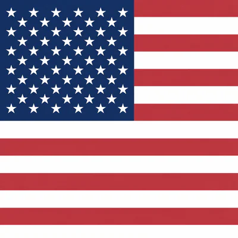
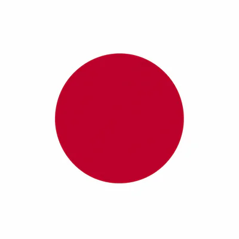
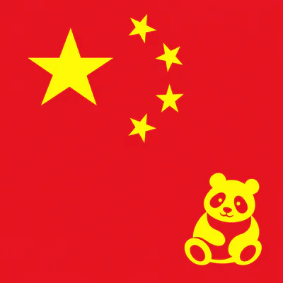
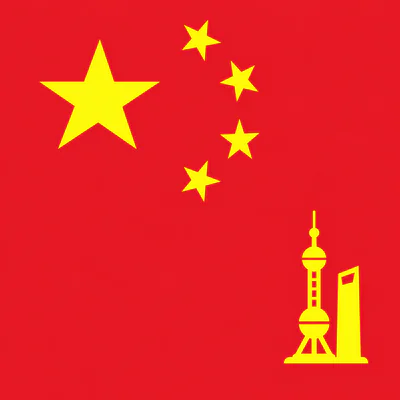

# Square Flags

**540 square flag designs** for websites, maps, apps, and other projects: 242
country entries and 298 subdivisions, available as optimized WebP images and
full-resolution PNG masters.

| United States                                                                                             | Japan                                                                                             | Sichuan                                                                                                                        | Shanghai                                                                                                                          |
| --------------------------------------------------------------------------------------------------------- | ------------------------------------------------------------------------------------------------- | ------------------------------------------------------------------------------------------------------------------------------ | --------------------------------------------------------------------------------------------------------------------------------- |
|  |  |  |  |

The collection includes square adaptations of national and regional flags, plus
custom geographic illustrations. In version **1.1.0**, 31 Chinese subdivisions
have distinct yellow cultural symbols in the lower-right corner, such as
Sichuan's panda, Beijing's Temple of Heaven, and Shanghai's skyline. These custom
designs are not official provincial flags.

## Download

- **Web images:** clone this repository or [download version 1.1.0](https://github.com/andr3wmccarthy/flag-assets/archive/refs/tags/v1.1.0.zip).
- **Full-resolution PNGs:** download `current-flag-masters-1.1.0.tar.gz` from the [latest artwork release](https://github.com/andr3wmccarthy/flag-assets/releases/tag/v1.1.0). It contains the 540 current designs, including the replacement Chinese subdivision artwork.

Each WebP is available at **48, 96, 144, 200, 400, and 600 pixels square**. Choose a
size appropriate to the display and pixel density, or provide responsive image
candidates so the browser can choose.

## Use the image files directly

No framework or JavaScript package is required. Copy `assets/1.1.0/` to a
`flags/1.1.0/` directory in your website's public files:

```sh
git clone --branch v1.1.0 https://github.com/andr3wmccarthy/flag-assets.git
mkdir -p public/flags
cp -R flag-assets/assets/1.1.0 public/flags/1.1.0
```

Then use an ordinary image element:

```html

```

Find each flag's filenames and available sizes in the
[manifest](assets/1.1.0/manifest.json). Native apps and other tools can bundle
these same files and read the manifest directly.

## Optional JavaScript helpers

Install the package from GitHub:

```sh
npm install git+https://github.com/andr3wmccarthy/flag-assets.git#v1.1.0
```

Its package name is `@workspace/flag-assets`. In your build script, copy the
bundled releases into your site's public directory:

```js
import { copyFlagAssets } from "@workspace/flag-assets/build";

copyFlagAssets("./public");
```

Look up images by country or subdivision code:

```js
import {
  getCountryFlagUrl,
  getSubdivisionFlagUrl,
  getFlagSrcSet,
} from "@workspace/flag-assets";

const src = getCountryFlagUrl("JP");
const subdivisionSrc = getSubdivisionFlagUrl("CN-SC");
const srcSet = getFlagSrcSet(src);
```

For example, in React:

```jsx

```

Lookups are case-insensitive, support the aliases recorded in the manifest, and
return `undefined` for unknown codes. The default image is 400px. `getFlagSrcSet`
provides all six sizes; set `sizes` to match the image's displayed width.

If you serve the files from another origin, pass that origin to the lookup:

```js
getCountryFlagUrl("JP", "https://assets.example.com");
```

The origin must host the copied files under `/flags/1.1.0/`.

## Versions and file integrity

Asset paths contain a release version and a source hash. Released files stay
unchanged, so you can pin a version and cache its URLs long-term. The build helper
copies every included release to preserve earlier URLs.

The manifest records dimensions, byte sizes, and SHA-256 checksums for every
WebP. [masters.json](masters.json) lists the current PNG masters and their
checksums; [recovery.json](recovery.json) contains the PNG archive checksum.
The PNG archive is a release attachment, keeping ordinary Git clones small.

## Artwork and attribution

The manifest includes each design's source page, available license information,
and notes about adaptations. Some entries retain custom geographic codes rather
than ISO codes. The collection is not a complete catalog of every subdivision.

License information is recorded per design; unknown licenses are marked `null`.
This repository does not grant a blanket license for all underlying flag artwork.
The prompts for the Chinese subdivision illustrations are included in
[artwork/1.1.0/prompts.json](artwork/1.1.0/prompts.json).
